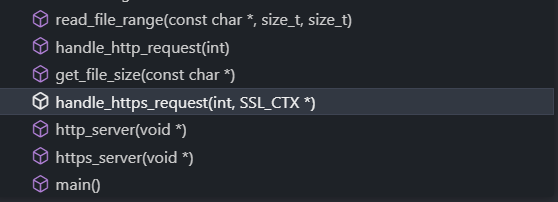
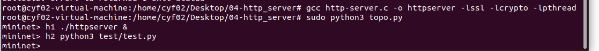
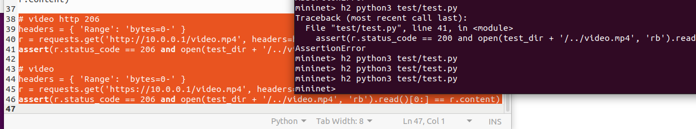

# 1.使用C语言实现最简单的HTTP服务器

## 1.1 main 函数和代码框架

main()函数如下：

```c
int main() {
    pthread_t http_thread, https_thread;
    int http_port = HTTP_PORT;
    int https_port = HTTPS_PORT;

    ...
    SSL_CTX* ssl_context = SSL_CTX_new(TLS_server_method());
    // 为SSL配置证书和私钥
    if (SSL_CTX_use_certificate_file(ssl_context, CERT_FILE, SSL_FILETYPE_PEM) <= 0 ||
        SSL_CTX_use_PrivateKey_file(ssl_context, KEY_FILE, SSL_FILETYPE_PEM) <= 0) {
        fprintf(stderr, "Error loading certificate or private key file\n");
        SSL_CTX_free(ssl_context);
        return EXIT_FAILURE;
    }

    // 使用两个线程分别监听各自端口
    pthread_create(&http_thread, NULL, http_server, (void*)&http_port);
    struct ThreadArgs https_args = {https_port, ssl_context};
    pthread_create(&https_thread, NULL, https_server, (void*)&https_args);

    pthread_join(http_thread, NULL);
    pthread_join(https_thread, NULL);

    // 清理 SSL 上下文
	...

    return 0;
}
```

主要函数如下：




## 1.2 http_server, handle_http_request

http_server处理http端口请求，因为实验要求80端口的请求只需要返回301状态，同时跳转到https即可，因此逻辑较为简单，在http_server线程中循环监听请求，当收到请求后交给handle_http_request进行处理。关键代码如下：

```c
while (1) {
        /* 接收一个客户端连接，返回值为成功建立连接的套接字 */
        client_socket = accept(server_socket, (struct sockaddr*)&client_addr, &client_addr_len);
        if (client_socket == -1) {
            perror("Error accepting connection");
            continue;
        }
        handle_http_request(client_socket);   
}
```

在handle_http_request方法中对http URL进行拼接，然后在应答中使用Location字段表达相应的https URL


```c
const char* https_url = "https://192.168.101.132";  

    // 301 Moved Permanently
    char moved_response[1024];
    snprintf(moved_response, sizeof(moved_response),
            "HTTP/1.1 301 Moved Permanently\r\nLocation: %s%s\r\nContent-Type: text/plain\r\n\r\nResource moved permanently. Please use the HTTPS URL.", 
            https_url, requested_resource);
    send(client_socket, moved_response, sizeof(moved_response), 0);
```


## 1.3 https_server

https_server处理https端口请求，当收到请求后交给handle_https_request进行处理,与http并无太大区别，主要是多传递一个ssl_context参数。关键代码如下：

```c
	while (1) {
        /* 接收一个客户端连接，返回值为成功建立连接的套接字 */
        client_socket = accept(server_socket, (struct sockaddr*)&client_addr, &client_addr_len);
        if (client_socket == -1) {
            perror("Error accepting connection");
            continue;
        }
        handle_https_request(client_socket, ssl_context);   
	}
```


## 1.4  handle_https_request

在handle_https_request方法中需要解析请求报文，并提供状态码为200、206、404的三种不同的应答

- 404

使用文件描述符读取请求的资源，文件不存在时，返回404，并关闭ssl连接。


```c
    FILE* file = fopen(full_path, "rb");
    if (!file) {
        // 文件不存在
        header = "HTTP/1.1 404 Not Found\r\nContent-Type: text/plain\r\n";
        response_body = "Not Found";
        // 发送响应
        char full_response[1024];
        snprintf(full_response, sizeof(full_response), "%s\r\n%s\r\n", header, response_body);
        SSL_write(ssl, full_response, strlen(full_response));

        // 关闭 SSL 连接
        SSL_shutdown(ssl);
        SSL_free(ssl);
        return;
    }

```

- 200、206 

区别在于是否请求文件的全部内容，当请求全部内容时，可以直接使用while循环发送内容，返回200

```c
        char chunk_buffer[1024];
        size_t bytes_read;

        while ((bytes_read = fread(chunk_buffer, 1, sizeof(chunk_buffer), file)) > 0) {
            char chunk_size[32];
            snprintf(chunk_size, sizeof(chunk_size), "%zx\r\n", bytes_read);
            SSL_write(ssl, chunk_size, strlen(chunk_size));
            SSL_write(ssl, chunk_buffer, bytes_read);
            SSL_write(ssl, "\r\n", 2);
        }
        SSL_write(ssl, "0\r\n\r\n", 5);
```

当请求部分内容时，从请求头获取start和end参数后，使用read_file_range方法读取。

需要注意的是：当请求头为 `'Range': 'bytes=100-'`时，end应该是文件的结尾。

```c
char* read_file_range(const char* filename, size_t start, size_t end) {
    FILE* file = fopen(filename, "rb");
    if (!file) {
        perror("Error opening file");
        return NULL;
    }

    fseek(file, start, SEEK_SET);

    size_t size = end - start + 1;
    char* content = (char*)malloc(size);
    if (!content) {
        perror("Error allocating memory");
        fclose(file);
        return NULL;
    }

    fread(content, 1, size, file);

    fclose(file);
    return content;
}
```


## 1.5 实验结果

h1：后台运行http服务器

h2：运行测试程序，没有出现AssertionError，说明程序实现正确



# 2. HTTP服务器分发视频

第一步实现后，分发视频也很容易，


我在test.py中添加了

```python
# video http 206
headers = { 'Range': 'bytes=0-' }
r = requests.get('http://10.0.0.1/video.mp4', headers=headers, verify=False)
assert(r.status_code == 206 and open(test_dir + '/../video.mp4', 'rb').read()[0:] == r.content)

# video
headers = { 'Range': 'bytes=0-' }
r = requests.get('https://10.0.0.1/video.mp4', headers=headers, verify=False)
assert(r.status_code == 206 and open(test_dir + '/../video.mp4', 'rb').read()[0:] == r.content)
```

测试通过

